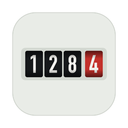
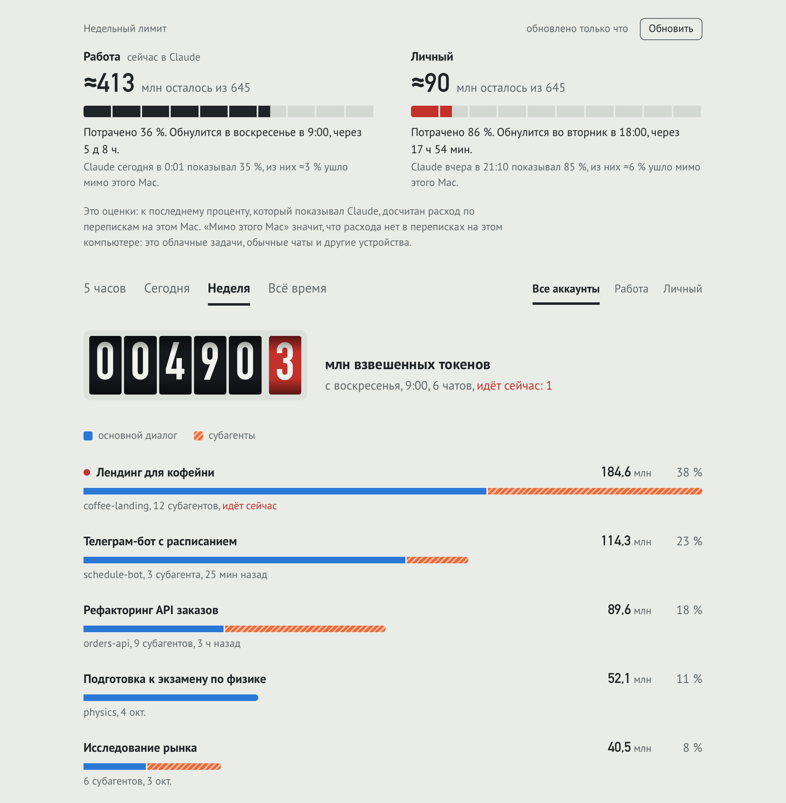

<p align="center"></p>

# Токенометр

Mac-приложение для тех, кто работает в Claude Code и упирается в лимиты. Показывает, сколько
осталось от недельного лимита каждого аккаунта и какие чаты его тратят: за 5 часов, сегодня,
неделю или всё время. Если аккаунтов несколько, держит чаты вкладки Code общими для всех: после
смены аккаунта в Claude все чаты на месте. А если вы работаете вместе с одного аккаунта,
[команда](#команды) видит, кто сколько потратил, и остаток лимита у всех одинаковый.

<picture>
  <source media="(prefers-color-scheme: dark)" srcset="docs/screenshot-dark.png">
  
</picture>

## Установка

Одна команда в Терминале:

```bash
curl -fsSL https://raw.githubusercontent.com/IceDarold/tokenometr/main/install.sh | bash
```

Токенометр появится в `~/Applications` и в Launchpad и сразу откроется. Чтобы он был под рукой,
щёлкни правой кнопкой по его значку в Dock и выбери «Параметры» → «Оставить в Dock». При первом
запуске macOS сообщит, что добавлен фоновый объект: это [перенос чатов между аккаунтами](#чаты-на-всех-аккаунтах).

Нужны macOS 13 или новее и Command Line Tools от Apple: Токенометр считает на Python, который
входит в их состав. Если их нет, установщик сам откроет установку от Apple.

Обновление делается той же командой. Удаление, вместе с переносом чатов:

```bash
curl -fsSL https://raw.githubusercontent.com/IceDarold/tokenometr/main/install.sh | bash -s -- --uninstall
```

## Что он показывает

- **Недельный лимит каждого аккаунта**: сколько осталось, когда обнулится и сколько ушло мимо
  этого Mac. Мимо Mac идут облачные задачи, обычные чаты и другие устройства.
- **Расход по чатам** за 5 часов, сегодня, неделю или всё время, по всем аккаунтам вместе или по
  одному. Полоска каждого чата делится на основной диалог и субагентов, а работающий сейчас чат
  отмечен красной точкой.
- **Перенос чатов между аккаунтами.** Строка под лимитами показывает, что он работает, и подсказывает,
  когда нужно перезапустить Claude.
- Расход пересчитывается каждые 30 секунд, официальный процент лимита обновляется каждые 5 минут.

## Откуда данные

Токенометр ничего никуда не отправляет. Он читает файлы на этом Mac, а меняет только списки чатов
Claude, когда переносит чаты между аккаунтами.

- Переписки Claude Code лежат в `~/.claude/projects`: и вкладки Code в приложении Claude, и запуски
  `claude` в терминале.
- Названия чатов и аккаунты берутся из `~/Library/Application Support/Claude`.
- Официальный процент лимита приходит из двух мест. Приложение Claude записывает его само, когда
  запрашивает лимиты. Кроме того, раз в 5 минут Токенометр спрашивает Claude Code CLI командой
  `claude -p /usage`. Это локальная команда: она узнаёт лимиты у API и не обращается к модели,
  поэтому токены не тратит. Если CLI не установлен, Токенометру хватает замеров приложения Claude.

## Как считается

- **Взвешенные токены.** Токены считаются по тому, как они тратят лимит. Повторное чтение
  переписки из кеша считается за 0,1 обычного токена, запись в кеш за 2, ответ Claude за 5.
- **Запросы.** Один ответ модели записан в переписке несколькими строками, поэтому каждый запрос
  считается один раз, по его идентификатору. Переписки субагентов относятся к своему чату.
- **Размер недельного лимита.** Anthropic не публикует его в токенах, поэтому Токенометр оценивает
  его сам. Он сравнивает, на сколько вырос официальный процент между двумя замерами одного
  аккаунта и сколько взвешенных токенов этот аккаунт потратил на Mac за то же время.
- **Израсходовано.** Последний официальный замер за эту неделю плюс то, что потрачено после него.
- **Мимо этого Mac.** Последний замер минус то, что видно в переписках на этом Mac с начала недели
  до этого замера. Облачные сессии живут на серверах Anthropic и переписок на Mac не оставляют,
  поэтому их видно только так.
- **Аккаунты.** Каждый запрос относится к аккаунту, который был активен в приложении Claude в этот
  момент. Неделя каждого аккаунта начинается в момент сброса его лимита. Время сброса Токенометр
  узнаёт от CLI, а если CLI нет, берёт воскресенье, 9:00.
- **Журнал замеров.** Приложение Claude хранит замеры 30 дней. Токенометр копит свою копию, чтобы
  раскладка по аккаунтам «за всё время» не терялась.

Имена аккаунтов и время сброса можно задать в `~/Library/Application Support/Tokenometr/accounts.json`.
Идентификатор аккаунта — это `orgId`, который печатает `claude auth status`.

```json
{
  "accounts": {
    "00000000-0000-0000-0000-000000000000": {"name": "Работа", "weekReset": "sun 09:00"},
    "11111111-1111-1111-1111-111111111111": {"name": "Личный", "weekReset": "tue 18:00"}
  }
}
```

## Чаты на всех аккаунтах

Приложение Claude хранит список чатов вкладки Code отдельно для каждого аккаунта, хотя сами переписки
у аккаунтов общие. Поэтому после смены аккаунта часть чатов пропадает из списка. Токенометр переносит
их сам: фоновая служба раз в пару секунд сверяет списки и раскладывает новые, переименованные,
архивные и удалённые чаты по всем аккаунтам. К моменту переключения аккаунта все чаты уже на месте.

- Служба запускается при входе в macOS и работает, даже когда окно Токенометра закрыто. Она видна в
  «Системные настройки» → «Основные» → «Объекты входа».
- Пока Claude открыт, список его текущего аккаунта служба не перезаписывает: Claude держит этот список
  в памяти. Новые чаты туда всё же добавляются, и Claude покажет их после перезапуска. Остальные
  изменения этого списка ждут, пока Claude закроется.
- Ссылки Remote Control и коннекторы claude.ai у каждого аккаунта остаются свои.
- Аккаунт, который впервые входит в Claude на этом Mac, увидит все чаты после одного перезапуска Claude.
- Переносятся только чаты вкладки Code на этом Mac. Чаты вкладки Chat и облачные сессии хранятся на
  серверах Anthropic у каждого аккаунта отдельно. Группы в боковой панели тоже у каждого аккаунта свои.
- Перед первым переносом Токенометр сохраняет копию всех списков, а заменённые и удалённые карточки
  чатов хранит 14 дней. Всё это лежит в `~/Library/Application Support/Tokenometr/chat-sync-backups`,
  журнал службы — в `~/Library/Logs/Tokenometr/chat-sync.log`.

Выключить перенос:

```bash
touch ~/Library/Application\ Support/Tokenometr/chat-sync-off
```

Чтобы включить его снова, удали этот файл.

## Команды

Если несколько человек работают с одного аккаунта Claude, каждый видит остаток лимита только по своим
чатам, а общий процент Claude показывает, сколько ушло всего. Команда складывает расход всех
участников: [tokenometr.archik.tech](https://tokenometr.archik.tech) и окно Токенометра показывают, кто
сколько потратил и на какие чаты, а остаток лимита у всех один и тот же.

1. Войдите на сайте, создайте команду и позовите людей ссылкой.
2. Каждый ставит Токенометр 1.2 или новее и нажимает «Команда» → «Подключить к команде». Приложение
   покажет код и откроет сайт: войдите и подтвердите код.
3. Отметьте на сайте общий аккаунт Claude, в разделе «Аккаунты Claude». С этого момента Токенометры
   участников присылают по нему расход раз в пять минут.

**Что уходит с Mac.** Только по общим аккаунтам: названия чатов и имя папки (последняя часть пути),
признак архива, число субагентов, время последней активности, число токенов по пятиминутным
интервалам и замеры лимита. Ещё сайт знает имя Mac, версию приложения и список аккаунтов Claude,
которые Mac видел: этот список видит только владелец. Не уходят текст переписок, промпты, ответы,
пути к файлам и чаты личных аккаунтов. Полный список — на странице [Конфиденциальность](https://tokenometr.archik.tech/privacy).

**Где что лежит.** Токен подключения хранится в связке ключей (запись `local.tokenometr.team`), не в
файле. Отправку делает та же фоновая служба, что переносит чаты, поэтому она работает и при закрытом
окне. «Отключить» стирает токен на этом Mac; отозвать его на сайте можно в «Настройки» → «Устройства».
Состояние отправки и числа команды лежат в `~/Library/Application Support/Tokenometr/team.json` и
`team-state.json`.

Приложение само ничего не отправляет, пока вы его не подключите.

## Сборка из исходников

```bash
git clone https://github.com/IceDarold/tokenometr.git
cd tokenometr
./build.sh --install
```

Для сборки хватает Command Line Tools (`xcode-select --install`), Xcode не нужен. Скрипт прогоняет
тесты, собирает приложение для Apple Silicon и Intel, кладёт его в `build/` вместе с архивом для
релиза, а с `--install` ещё и устанавливает в `~/Applications`.

- `usage.py` считает расход и печатает его в JSON: `python3 usage.py`.
- `chatsync.py` переносит чаты между аккаунтами: `python3 chatsync.py` делает один проход, а с
  `--watch` следит за списками, как фоновая служба; она же раз в пять минут вызывает `teamsync.py`.
- `teamsync.py` подключает Mac к команде и отправляет на сайт расход общих аккаунтов:
  `connect`, `sync`, `disconnect`, `status`. Только стандартная библиотека, Python 3.9.
- `tokenometr_limits.py` — математика лимита (веса, недели, размер процента, банк). Её же ставит сайт
  как пакет, чтобы у приложения и сайта цифры совпадали.
- `web/index.html` — страница: барабаны счётчика, банки аккаунтов и список чатов.
- `app/main.swift` — окно. Оно запускает `usage.py` и передаёт результат странице, выполняет просьбы
  панели «Команда» (подключить, отключить, открыть сайт) и при запуске регистрирует фоновую службу.
- `app/make_icon.swift` рисует иконку.

Тесты: `python3 -m unittest discover -s tests` (`SKIP_TESTS=1 ./build.sh` пропускает их в сборке,
если их только что прогнали). Им нужен только Python 3.9 или новее.

Выпуск новой версии: поднять `CFBundleShortVersionString` в `app/Info.plist`, выполнить
`./build.sh` и `gh release create vX.Y.Z build/Tokenometr.zip`. Установщик всегда берёт последний релиз.

## Лицензия

MIT. Неофициальный проект, не связан с Anthropic.
